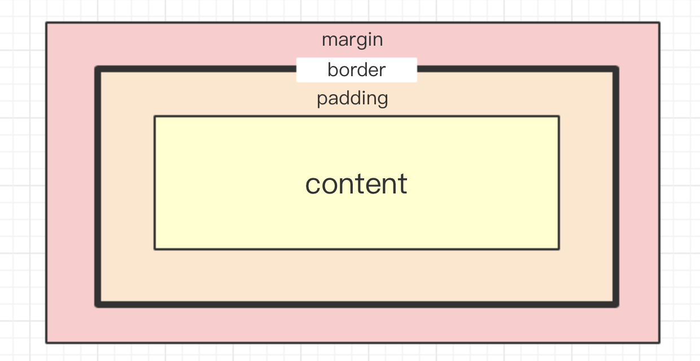
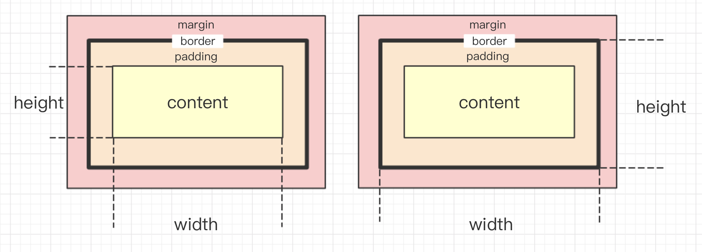
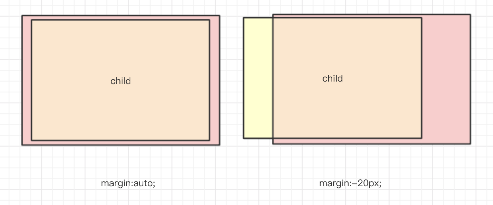
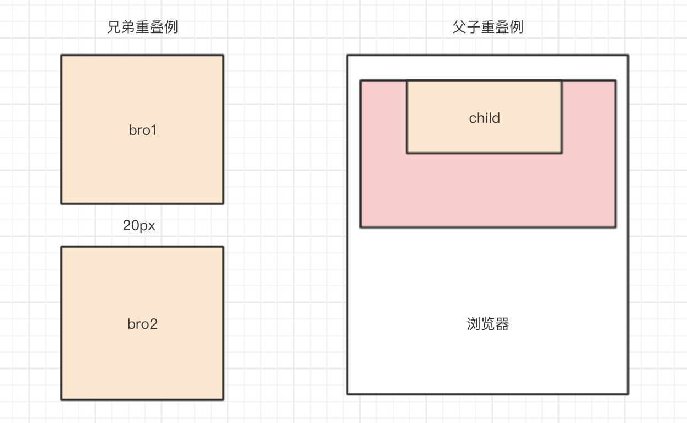

# CSS 盒模型



> 当我们面对一个页面的时候，我们可以将它抽象成一块块矩形区域，页面上的每一个文档元素都占据了这样的一个矩形，像是放在一个个矩形的盒子中，从而我们有了盒模型的概念

这篇文章对CSS中的盒子模型进行一个简单的总结，包括：
- 盒模型的分类
- 宽度和高度
- padding
- margin，margin负值，margin重叠
- border

## 两种不同的盒模型
盒模型有两种常见的形式，标准盒模型和IE盒模型：

- W3C的标准模型：容器的width和height仅仅表示内容区域（上图中的content）的宽度和高度，增加border、padding和margin都会使元素实际占据的空间变大
- IE盒模型：容器的width和height仅仅表示所有可见区域，也就是content+padding+border的大小，只有margin不被包含在其中


> 个人理解：IE盒模型更加符合设计的想法，在还原设计稿件的时候也更加便于计算，并且有一些表单元素仍然是按照IE盒模型进行渲染的

我们也可以通过CSS 手动设置盒模型的类型：
```css
/* IE盒模型 */
#div1{
    box-sizing:border-box;
}
/* 标准盒模型 */
#div2{
    box-sizing:padding-box;
}
```

## width 和 height

width 和 height 属性决定了盒子的大小（参见上一小节）

width和height可以取的值有
- length（常用单位：px，em，rem）
- percentage
- auto
- inherit

### auto
宽高和margin可以设置auto。对于块级元素来说，宽度设置为auto，则会尽可能的宽；高度设置为auto，则会尽可能的窄
**注意：** 如果没有显式声明包含块的height，则元素的百分数高度会重置为auto

### max-width/min-width/max-height/min-height

设置最大最小宽高的好处是可以相对安全地混合使用不同的单位。使用百分数大小的同时，也可以设置基于长度的限制

同时使用这个限制也有助于在不同媒体下的显示，有助于响应式布局下的用户体验
```css
/* IE盒模型 */
#container{
    min-width:960px;
    min-height:100%;
}
```
min-width/min-height 初始值为0；max-width/max-height 初始值为none

## padding
padding，盒模型的内边距，常见的使用场景是避免文字或者图片紧紧贴着容器边缘

对于行内元素，左内边距应用到元素的开始处，右内边距应用到元素的结尾处，垂直内边距不影响行高，但会影响自身尺寸，加背景颜色可以看出

padding可以直接定义四个方向的内边距：
```css
#div1{
    /* 上下左右 10px */
    padding: 10px;
}
#div2{
    /* 上下为 10px 左右 20px*/
    padding: 10px 20px;
}
#div3{
    /* 上 10px 左右 20px 下 30px*/
    padding: 10px 20px 30px;
}
```
也可以通过 `padding-top/right/bottom/left` 分别进行设置（一般情况不会这样做的）

**注意：** 不管是上下padding还是左右padding，当我们使用百分比设置的时候，都是基于width的：
```css
#div4{
    height:200px;
    width:100px;
    padding: 10% 10%;
    /* 你以为上面的效果等同于：padding:20px 10px; */
    /* 并不是，应该是；padding:10px 10px; */
}
```
所以当我们想要让元素的大小保持一定的比例，不妨给设置padding的百分比，对于一个空元素，我们设置`padding:50%;`就可以让这个元素表现为正方形

我们也可以利用这一点设置banner在不同宽度下的固定长宽比例：
```css
.banner{
    width:100%;
    box-sizing:border-box;
    border:30% 50%;
    background:url('图片地址');
}
```

## margin
margin，盒模型的外边距，常见的使用场景是让一个元素的可见区域和其他元素分开

margin的定义方法和padding相似，也可以一次性设置四个方向的margin，同样可以分开设置 `margin-top/right/bottom/left`

margin 的区域是透明的，可以看到父元素的北京等内容

外边距可以应用到行内元素，上下外边距对行高没有任何影响；左外边距应用到元素开始处；右外边距应用到元素结束处

**注意：** margin通过百分比设置的时候同样是基于宽度的

### margin负值
margin和padding的一个非常大的不同点在于 **margin可以取负值**

当margin取负值的时候可以形成一个视觉上的平移效果，同时对于`block`、`inline`、`inline-block` 的表现略有不同

- block元素可以使用四个方向的margin值
- inline元素使用上下方向的margin值无效
- inline-block使用上下方向的margin负值看会受到`vertical-align`的影响

同时，在margin负值的影响下还可能造成元素的重叠

- 两个block元素重叠时，后面元素可以覆盖前面元素的背景，但无法覆盖其内容
- 当两个inline元素，或两个line-block元素，或inline与inline-block元素重叠时，后面元素可以覆盖前面元素的背景和内容
- 当inline元素(或inline-block元素)与block元素重叠时，inline元素(或inline-block元素)覆盖block元素的背景，而内容的话， 后面的元素覆盖前面的元素

常见的应用场景有多列布局等

### margin 重叠
- 只发生在block元素上(不包括float、absolute、inline-block元素)
- 只发生在垂直方向上(不考虑writing-mode)
- margin的重叠发生可以发生在父子元素、兄弟元素和元素本身上


#### 兄弟元素
表现为两个兄弟元素之间的margin会合并，并且按照较大margin宽度的计算布局
```css
div{
    width:100px;
    height:100px;
}
#bro1{
    margin-bottom:10px:
}
#bro2{
    margin-top:20px;
}
```
#### 父子元素
父子元素发生重叠主要针对于父元素和它的第一个子元素/最后一个元素
相对比相邻兄弟元素margin重叠来说，父子级margin重叠需要满足以下几个条件(以margin-top重叠为例)：
- 父元素不形成BFC（块级格式化上下文）
- 父元素没有padding-top/bottom值
- 父元素没有border-top/bottom值
- 父元素和第一个子元素/最后一个元素之间没有inline元素分隔

另外针对最后一个元素还要满足条件：没有height、min-height、max-height
例子如上图（粉色为parent）
```css
.parent{
    width:800px;
    height:600px;
}
.child{
    width:400px;
    height:200px;
    margin-top:80px;
}
```
这时parent会收到child的影响，一起下移
#### 元素本身
如果存在一个空的块级元素，其border、padding、inline content、height、min-height都不存在，那么此时它的上下边距中间将没有任何阻隔，此时它的上下外边距将会合并。
## border
元素外边距内就是元素的边框border，元素的边框是围绕元素内容的内边距的一条或多条线。边框由粗细、样式和颜色三部分组成

border 的样式由三部分构成：宽度、样式、颜色，他们用空格分开
```css
#div5{
    /* 1px 宽度 实线 黑色 */
    border:1px solid #000;
}
```

同时我们可以使用`border-width`、`border-style`、`border-color`进行分别定义

- 如果要定义单个方向的边框，可以用`border-top/right/bottom/left`来定义，也可以在后面加上width/style/color
- border-style的值可以为solid（实线），dashed（虚线），dotted（点线），double（双线），groove（凹刻），ridge（浮雕），inset（整体下沉），outset（整体突出）
```css
#div6{
    border:1px solid #000;
    border-top:3px dashed #333;
    border-right-width:2px;
}
```
