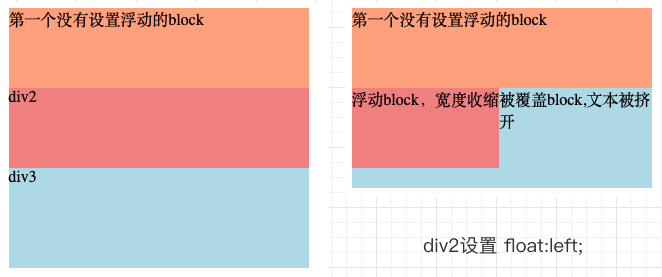
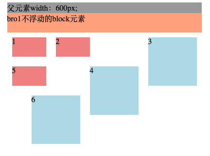
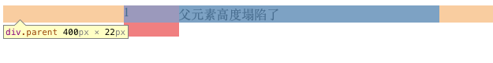
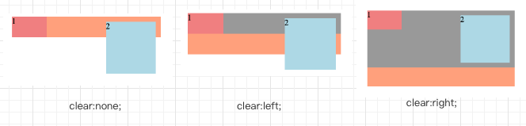

# 浮动与清除浮动
浮动布局是一种常见的布局方式，最初的使用目的是进行图文的混排

这篇文章对浮动布局进行简单的总结，包括以下内容：
- 浮动
    - 单个浮动元素
    - 多个浮动元素
    - 父子元素
- 清除浮动
- 浮动的使用场景

## 浮动
浮动通过css定义：
```css
#div1{
    float:left;
}
```

浮动可以取的值：none（默认）|left|right

当元素进行左浮动或者右浮动之后会脱离文档流，并且构成一个浮动流，会覆盖在没有浮动的元素上，并且允许文本和内联元素环绕在它周围；浮动元素不会超出父元素的上、左、右边界：
```html
<div class="parent">
    <div class="bro1">第一个没有设置浮动的block</div>
    <div class="bro2">浮动block，宽度收缩</div>
    <div class="bro3">被覆盖block,文本被挤开</div>
</div>
```
```css
.parent {
    width: 300px;
    margin: 0 auto;
    background: #999;
}
.bro1,.bro2 {
    height: 80px;
}
.bro1 {background: lightsalmon;}
.bro2 {
    float: left;
    background: lightcoral;
}
.bro3 {
    height: 100px;
    background: lightblue;
}
```


通过这个例子我们可以看出，当元素设置为浮动元素的时候会产生下列影响：
- 浮动元素宽度默认为内容的宽度
- 向指定的浮动方向一直移动
- 对它之前的block没有影响
- 会掩盖后面的block元素，但是不会遮盖其中的文本和内联元素

### 多个浮动元素
当同一个父元素下存在多个浮动的子元素的时候，这些子元素按照浮动流排布:
- 多个浮动元素不会相互重叠
- 浮动元素按照在父元素中的书写顺序，从上至下排布
- 当同一行有空间的时候，不管左浮动还是右浮动，都优先在同一行排列
- 当同一行没有空间，后续浮动元素会从上至下寻找空间
- 浮动元素的上下左右margin不会发生重叠合并

下面的例子中，`.left`表示左浮动，大小70px/40px；外边距10px`.right`表示右浮动；大小100px/100px 外边距10px

```html
<div class="parent">
    父元素width：600px;
    <div class="bro1">bro1不浮动的block元素</div>
    <div class="left">1</div>
    <div class="left">2</div>
    <div class="right">3</div>
    <div class="right">4</div>
    <div class="left">5</div>
    <div class="right">6</div>
</div>
```


(读者可以写一个类似的demo来感受一下,改变parent元素的宽度会有很多不同的排列效果)

### 父子元素
这一点主要是指，当子元素浮动的时候可能会发生父元素高度塌陷的情况
```html
<div class="parent">
    <div class="left">浮动元素</div>
</div>
```
```css
.parent {
    width: 400px;
    margin: 0 auto;
    background: #999;
}
.left {
    width: 70px;
    height: 40px;
    float: left;
    background: lightcoral;
}
```


这个现象往往会造成不好的影响，我们需要通过清除浮动解决

## 清除浮动
浮动的清除有两种主要方案：
- 下一个元素具有clear属性
- 父元素形成BFC

### clear
clear属性可以取值：none（默认）|left|right|both

分别表示：不清除浮动|清除左浮动|清除右浮动|全部清除

具体效果看例子：
```html
<div class="parent">
    <div class="left">1</div>
    <div class="right">2</div>
    <div class="bro"></div>
</div>
```
```css
.parent {
    width: 300px;
    margin: 0 auto;
    background: #999;}
.left {
    width: 70px;
    height: 40px;
    float: left;
    background: lightcoral;}
.right {
    float: right;
    margin: 10px;
    width: 100px;
    height: 100px;
    background: lightblue;
}
.bro {
    height: 40px;
    margin-top: 10;
    background: lightsalmon; }
```
接下来为bro设置clear属性，表现如下



我们可以注意到：
- `float:left;`的元素不再覆盖`clear:left;`的元素，right同理
- `float:right;`的元素和`clear:left;`的元素发生了margin合并，left同理
- 父元素被撑开了

由此我们得到一种避免父元素高度塌陷的方法——在末尾添加一个清除浮动元素，除了可以添加实际的html标签之外，我们也可以通过伪元素来解决，给父元素添加这样一个类：
```css
.clear:after{
    content:""; 
    display: block; 
    clear: both;}
```

### 通过BFC
BFC（块级格式化上下文）

BFC究竟是什么含义，读者可以自行搜索，或者在我左边的文章列表里找一找（希望你看到这里时我更新了关于BFC的文章）

我们可以将浮动元素的父元素进行如下设置中的任意一个：
- float: left/right
- position:absolute/fixed
- display:inline-block/table-cell/table-caption/flex
- overflow:hidden/scroll/auto

我个人建议使用`overflow:hidden;`，相比于其他选择，这个方法的副作用最小