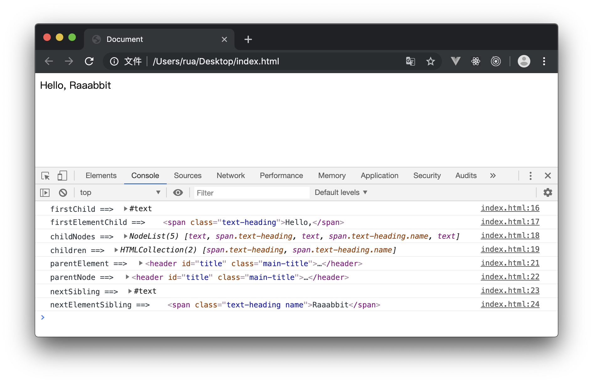

# 节点操作——获取节点

DOM 是 JavaScript 操作网页的接口，全称为“文档对象模型”（Document Object Model）。它的作用是将网页转为一个 JavaScript 对象，从而可以用脚本进行各种操作

针对节点进行操作的第一步当然就是获取节点，目前已经衍生出了很多获取节点的方案

我们先写一段简单的 HTML 代码，

```html
<body>
  <header id="title" class="main-title">
    <span class="text-heading">Hello,</span>
    <span class="text-heading name">Raaabbit</span>
  </header>
</body>
```
后面的代码就基于上面的 demo 展开

针对节点进行操作的第一步当然就是获取节点，目前已经衍生出了很多获取节点的方案

## 通过元素选择器获取

元素选择器相关的内容可以参考我的博客，CSS选择器一节

这种方法主要在于通过元素的 id、class 和标签名获取元素，常用以下三个方法：
 
- getElementById()
- getElementsByClassName()
- getElementsByTagName()

**⚠️注意：** 这些方法既可以用于HTML文档对象，也可以用于element元素对象

下面分别进行详细介绍：

### getElementById

```js
let title = document.getElementById('title');
```

按照规范在 HTML 中，id 是唯一的，所以通过这样的方式可以获得唯一的元素，事实上若浏览器中出现多个id名的情况，CSS样式对所有该id名的元素都生效，但这个方法仅对第一个出现该id名的元素生效

### getElementsByClassName

```js
let textHeadings = document.getElementsByClassName('text-heading');
console.log(textHeadings[1]);
```

我们可以很容易通过这个方法名看出来，`elements` 就可以体现出，这个方法获得的不是单个节点，而是一个类数组对象 HTMLCollection，我们可以通过下标访问其中的每一个节点

**⚠️注意：** 我们可以用多个类名作为参数，类名的先后顺序不重要，如：
```js
// 只有同时有类名 text-heading 和 name 时才可以获取到
let textHeadings = document.getElementsByClassName('text-heading name');
```
由于这个方法不支持 IE9 以下浏览器，所以需要使用兼容的写法：
```js
function getElementsByClassName(node,className){
  if(node.getElementsByClassName){                    //特性侦测
    return node.getElementsByClassName(className);  //优先使用W3C规范
  }
  else{
    let results = new Array();
    let elems = node.getElementsByTagName("*");     //获取所有后代元素
    for(let i = 0;i < elems.length;i++){
      if(elems[i].className.indexOf(classname) != -1){
        results[results.length] = elems[i];     //扩容
      }
    }
    return results;
  }
}
```

### getElementsByTagName

在上面给出的兼容方法中已经使用到了这个方法，getElementsByTagName 方法接收一个参数，即要取得元素的标签名，返回的也是类数组对象 HTMLCollection

```js
let spans = document.getElementsByTagName('span');
```

## 通过 selector 获取

相信很多人都使用或者学习过 JQuery，其中有一个很方便的获取元素节点的方法 `$`，比如我们可以通过 `$('.text-heading')` 这样的方式快速获取节点，这里的节点是包装后的 JQuery 对象，并不是原生的 DOM 节点

而 HTML5 中添加了新的方法，通过 CSS 选择器更加灵活地获取节点

### querySelector
querySelector 方法接收一个 CSS 选择器，返回与该模式匹配的第一个元素，如果没有找到匹配的元素，返回null

该方法既可用于文档document类型，也可用于元素element类型
```js
let body = document.querySelector("body");
```

### querySelectorAll

querySelectorAll 同样接收一个CSS选择符，和上一个方法的区别在于返回一个类数组对象 NodeList
```js
let spans = document.querySelectorAll(".text-heading");
```

这两个方法有一个很重要的特点，他们的返回值不是动态的，更像是一个快照，我们先调用 querySelectorAll 方法获取节点后，对相关的节点进行添加/删除/修改操作后，这个值并不改变：

```js
// 本文最上方的例子
let spans = document.querySelectorAll("span");
console.log(spans.length); // 2
let newSpan = document.createElement('span');
document.getElementById('title').appendChild(newSpan);

console.log(spans.length); // 2，实际上现在已经有 3 个 span了
```

## 通过节点关系获取

有的时候我们不仅需要对节点进行操作，还需要连带操作它的父子/兄弟节点，我们也可以调用以下方法；
- 父子关系：
  - parentNode/parentElement
  - firstChild/lastChild
  - childNodes/childern
- 兄弟关系
  - previousSibling/nextSibling
  - previousElementSibling/nextElementSibling

使用例子如下：
```js
let title = document.getElementsByClassName('main-title')[0];
console.log("firstChild ==> ", title.firstChild);
console.log("firstElementChild ==> ", title.firstElementChild);
console.log("childNodes ==> ", title.childNodes);
console.log("children ==> ", title.children);
let textHeading0 = document.getElementsByClassName('text-heading')[0];
console.log("parentElement ==> ", textHeading0.parentElement);
console.log("parentNode ==> ", textHeading0.parentNode);
console.log("nextSibling ==> ", textHeading0.nextSibling);
console.log("nextElementSibling ==> ", textHeading0.nextElementSibling);
```
结果如下：


由于随着目前前端的交互性越来越强，页面上元素变化较大，这些方法有比较大的局限性，可维护性比较差

从另一个角度来说，有时我们不知道要获取的元素的 id、class 甚至不知道 tag，通过节点关系获取元素也是一种不错的方案

## 总结

本文中列出的一些方法特性如下，多种方法结合使用效果更佳～

name|only document| sole(唯一的) |live(动态的)
---|---|---|---
getElementById|*|*| 
getElementsByTagName| | | *
getElementsByClassName| | |*
querySelectorAll| | | 
querySelector| |*|

## 扩展内容 Node 节点和 Element 节点

通过上文中的一个图片（全文中好像只有一张图）我们可以看到，在获取节点或者节点列表中出现了两种不同的结果，分别是 `NodeList` 和 `HTMLCollection` 这是两种不同的集合，成员分别是 `Node`
节点和 `Element` 节点

NodeList 实例对象是一个类数组对象，它的成员是节点对象，包括childNodes和querySelectorAll()方法返回值

HTMLCollection 集合包括getElementsByTagName()、getElementsByClassName()、getElementsByName()等方法的返回值，以及children

这两种集合的主要区别在于是否具有**动态性**（见上文）

Node 和 Element 具有继承关系，Element 继承了 Node 接口，因此Element 上具有 Node 的属性和方法

除了 element 之外 node 还包括很多类型，列举如下；

- 元素节点：ELEMENT
- 属性节点：ATTRIBUTE
- 文本节点：TEXT
- CDATA节点：CDATA_SECTION
- 实体引用名称节点：ENTRY_REFERENCE
- 实体名称节点：ENTITY
- 处理指令节点：PROCESSING_INSTRUCTION
- 注释节点：COMMENT
- 文档节点：DOCUMENT
- 文档类型节点：DOCUMENT_TYPE
- 文档片段节点：DOCUMENT_FRAGMENT
- DTD声明节点：NOTATION

这些不同的 node 类型具有共同的属性（nodeType、nodeName、nodeValue等）和方法，还有一些特有的属性和方法，在此不过多赘述
