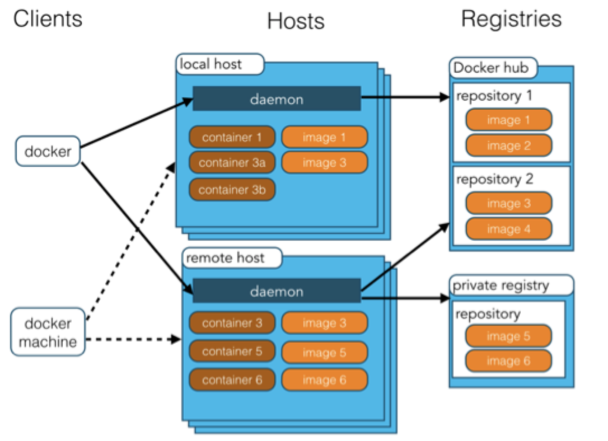

# Docker入门——理解Docker

图片源：https://www.docker.com/
## Docker是什么
什么是Docker，可以参考我之前第一次接触Docker写的文章 -> [docker 初体验](https://blog.csdn.net/github_39457740/article/details/82919425)

在这里也简单进行一个总结：

首先我们要明确容器的概念，容器是一个运行在操作系统内核上的用户空间，可以让多个独立的用户空间运行在同一个宿主机上

然而容器的安装、管理和自动化都很复杂，所以在很长一段时间内，容器并没有被广泛使用

Docker的出现打破了这个局面：Docker在虚拟化的容器执行环境中增加了一个应用程序部署引擎，从而提供了一个轻量快速的环境，能够运行开发者的程序，并且方便开发者在开发环境、测试环境和运行环境快速的迁移部署

## Docker的优势
既然我们已经有了虚拟机来作为虚拟环境，为什么我们还需要容器这样的虚拟环境，是基于一下这些优点：
- 简单快速：Docker上手快速，并且可以进行写时复制，可以很方便地更改程序
- 性能：Docker容器的启动也非常迅速，由于没有管理程序的开销，Docker的性能非常优良，可以充分利用系统资源
- 职责分离：开发人员只需要关心容器中运行的应用程序，运维人员只需要关心容器的管理；进一步来说，Docker可以保证开发环境和生产环境的一致性，避免由于环境导致的问题
- 面向服务：Docker鼓励面向服务的架构和为服务架构，推荐只在单个容器中运行一个应用程序或者进程，形成一个分布式应用模型，提高扩展性

## Docker的核心组建
为了理解并使用Docker，我们要先理解一些基本概念

- Docker客户端和服务器
- Docker镜像
- Registry
- Docker容器

### Docker客户端和服务器
Docker客户端和服务器是一个基于C/S架构的程序：Docker客户端向服务端或者守护进程发送请求，服务器或者守护进程完成工作并返回结果

Docker提供了一套自己的命令行工具，另外还有一套用来进行交互的API；同时客户端和服务端可以运行在同一台宿主机上，也可以将客户端连接到远程环境上的Docker服务

### Docker镜像
镜像是构建Docker的基础，用户基于镜像来运行自己的容器

Docker 把应用程序及其依赖，打包在镜像文件里面。只有通过这个文件，才能生成 Docker 容器。image 文件可以看作是容器的模板。Docker 根据镜像文件生成容器的实例。同一个镜像文件，可以生成多个同时运行的容器实例。

镜像是二进制文件。实际开发中，一个镜像文件往往通过继承另一个 镜像文件，加上一些个性化设置而生成。举例来说，你可以在 Ubuntu 的镜像基础上，往里面加入 Apache 服务器，形成你的镜像。

### Registry
Docker 仓库用来保存镜像，可以理解为代码控制中的代码仓库。

Docker公司负责运营的仓库是 Docker Hub(https://hub.docker.com) ，这个仓库提供了庞大的镜像集合供使用，我们可以在这里注册账号分享自己的镜像。

### Docker容器
Docker容器是独立运行的一组或者一个应用程序

在Docker中，镜像主要用来进行构建打包，而容器主要用来进行应用或者服务的启动和执行

Docker借鉴了集装箱的概念，我们可以这样理解：Docker是一艘运输船，Docker容器是一个集装箱，Docker中运行的软件/服务是货物

在容器这个集装箱是又很强的适用性的，根据不同镜像构建的容器是可以以相同的方式装载不同的软件的

