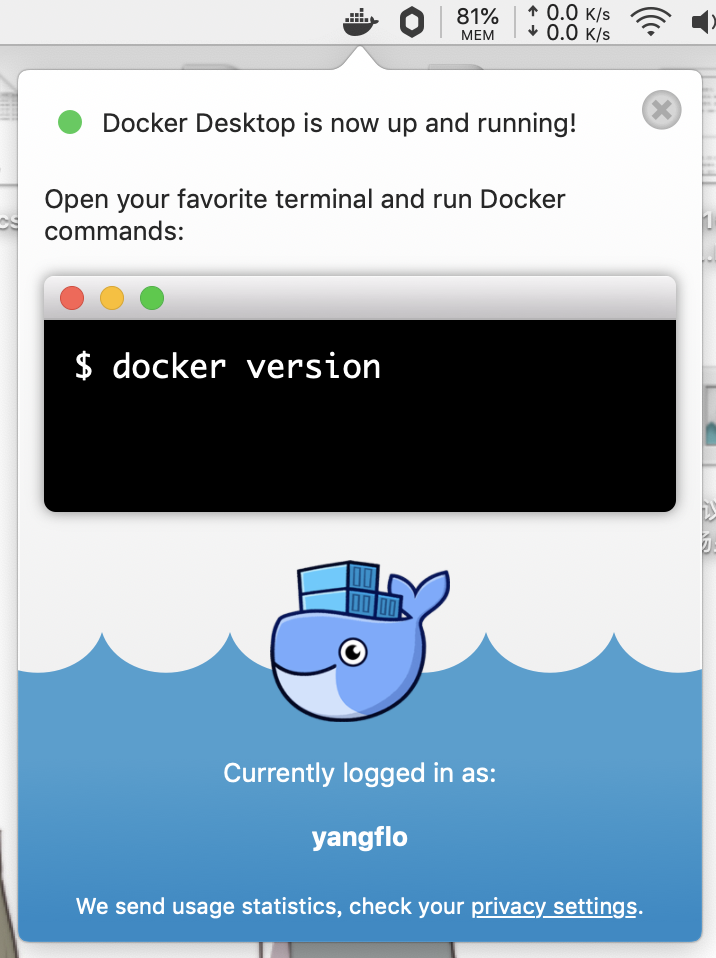

# Docker入门——用docker运行容器（一）
> 在我的上一篇文章 [Docker——理解Docker](https://raaabbit.github.io/Docker/%E7%90%86%E8%A7%A3Docker/#docker%E6%98%AF%E4%BB%80%E4%B9%88)中，我们已经进行了一些整理简述了一些 Docker 的基本概念    
> 在这篇文章中，我将对Docker的初步使用进行总结，同时进一步明确一些概念

## 安装
安装确实没有什么好说的，我相信对Docker有兴趣的你一定不会被这个问题难住

（事实上，没有必要写安装步骤，因为即便是写了安装步骤，不久后就会过时的，如果你使用的系统版本比较老，也许可以参考一下 Boot2Docker，Docker ToolBox

[当然优先参考官方文档](https://docs.docker.com/docker-for-mac/install/)

我安装的版本是 Docker Desktop for Mac，安装完成后顶部菜单栏会有一个可爱的小鲸鱼


## 让我们开始吧
安装成功之后我们可以尝试在终端中输入几条命令
```shell
$ docker info # 查看 Docker的基本信息
$ dorker version # 查看 Docker 的版本
```
如果终端显示正常，说明Docker安装成功了（鼓掌）

## 运行第一个容器
已经说过很多次了 Docker 是一个用来将应用程序部署到容器的引擎，那么我们先尝试运行一个容器

使用 `docker run`命令运行一个容器，比如我们可以先运行一个ubuntu
```shell
$ sudo docker run -i -t ubuntu
```
关于这个命令的各种参数，我们可以参考官方文档或者只直接在终端中输入 `docker help run`，在这里的`-i`，`-t` 分别代表了提供交互式能力和一个临时终端

`docker run` 命令在执行的时候会先检查本地是否存在这个镜像，如果没有我们选定的 `ubuntu` ，Docker会连接官方维护的 Docker Hub Registry 并搜索是否有我们需要的镜像，随后通过 `docker pull` 为我们下载一个镜像


在上面的下载过程中我们可以注意一下，一个没有图形化界面的 ubuntu 镜像只需要不到400MB，Docker 的轻量的特点得到了很好的体现

随后 Docker 会在文件系统内部利用这个镜像创建一个容器，并进入这个容器的bash终端
```
root@ecd99d8d186c:/#
```

这个容器有自己的网络，IP地址，以及一个用来和物理机通信的网络接口

## 在容器中安装应用
我们看到现在终端中出现了一串神秘字符串：`root@ecd99d8d186c:/#` 这说明我们以root权限登录到了新容器中，后面一串字符串就是容器的ID，这也是在这个物理机上容器的唯一标识符，在物理机上进行一些操作的时候也许会用到这串 ID

我们在这个容器终端中检查主机名试试：
```
root@ecd99d8d186c:/# hostname
ecd99d8d186c
```
可以看到这个容器的主机名就是这串ID！

由于我们的容器是一个完整的Ubuntu系统，在这里可以随意尝试ubuntu系统中的命令，比如`ls` `ps` `top`（只要不涉及桌面系统

我们也可以在这个容器中安装常用的软件，一个很常用的使用场景是我们要将这个容器作为“代码的搬运工”，不妨在这里安装一个git用来及时地同步代码

由于这是一个空的容器，安装软件之前记得`apt-get update` 来同步软件，然后再去`apt-get install git`

## 启动我们的容器
当我们执行完任务之后，我们也许会直接关闭终端，或者按照正常的使用方式输入 `exit` 来退出我们的容器

那么我们应该怎么启动我们已经进行过操作的容器呢？再次执行`docker run`? 并不是！

如果你执行了 `docker run  -i -t ubuntu` 你将看到你再次进入了一个 Ubuntu 的 bash 中，但是容器的ID已经不是之前的ID了，也就是说你创建了一个新的容器

正确的做法：
- 执行 `docker ps -a` 查看当前系统下的所有 Docker，(如果不加 `-a` 参数，我们将只能看到运行中的容器，显然目前是没有的)
- 执行 `docker start ecd99d8d186c`，通过ID启动我们的容器，这时可以执行 `docker ps` 来判断这个容器是否在运行中
- 这个时候我们还是没有进入容器的命令行重的，我们可以输入 `docker attach ecd99d8d186c` 来重新附着到容器上


## 为我们的容器命名
上面我们都是通过 ID 的方式来选择我们要操作的容器，但是这样的随机序列是不可能强记的，我们也不能每次都查看系统中的镜像（如果你的日常开发流程都是通过Docker管理的，可能会有十几个容器）

为了方便我们的操作，我们应当给容器命名，同时 Docker 也会自动生成一个随机的名称，参见上面的截图我们可以看到我的实验容器的 NAME 是 pensive_yalow 

我们应当按照一定的的命名规范命名我们的容器，比如 `项目名称_开发阶段_负责人`，

我们可以在容器创建之初就命名这个容器
```
$ docker run --name dockerLearn_raaabbit -i -t ubuntu
```
也可以通过`rename` 对已经有的容器进行重命名
```
$ docker rename dockerLearn_raaabbit dockerTry_raaabbit
```


**注意：** 由于容器名也作为容器的唯一标识，所以命名要避免重复

## 守护式容器
设想一个这样的使用场景，我们要在服务器上部署一个 WebService 显然我们希望当我们退出容器终端之后，容器中的服务仍然在运行，这个时候我们就需要守护式容器

我们可以将之前创建的交互式容器运行起来，然后退出时不要输入 `exit` 也不要用 `ctrl+D`，而是使用 `ctrl+P ctrl+Q`（输入`ctrl+P` 后不要按下回车键）


look!我们的容器已经在后台保持运行了

- 如果我们想要进入容器进行操作只要 `docker attach dockerTry_raaabbit` 即可
- 如果我们想要停止这个容器的运行，执行`docker stop dockerTry_raaabbit`

或者我们也可以在创建之初就让容器成为守护式容器，和之前我们创建的有交互功能的交互式容器相比，守护式容器没有交互式会话，创建依赖于`docker run` 的参数 `-d`
```
$ docker run --name daemon_container -d ubuntu
```
执行上面这条命令，终端会显示一串字符串，也就是这个容器的完整id，此时用 `docker ps` 查看，并不能发现这个容器，这是因为容器中并没有正在运行的任务，尝试输入下面这条命令
```
docker fun --name daemon_hello -d ubuntu /bin/sh -c "while true; do echo hello; sleep 10; done"
```
容器中将执行一个死循环，直到容器停止为止

**这个容器记得停止运行，不然会一致循环下去的**

好了，这篇文章就写到这里，下一次将会对运行中的容器进行一个小小的探索