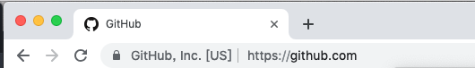

# HTML 文档标题
所谓文档标题，就是呈现在浏览器上的网页名称，如图：



一般来说我们只要在 `html` 文件中的title中确定即可
```html
<!DOCTYPE html>
<html lang="en">
<head>
    <meta charset="UTF-8">
    <!-- 在这里定义标题 -->
    <title>Document</title>
</head>
<body>
    <!-- body -->
</body>
</html>
```
下面记录在开发过程中遇到的一些小技巧。
## 设置icon
严格来说，这个并不是 `title` 标签决定的，但是在这里放在一起看吧～
- 首先我们要得到 `.ico` 扩展的图片文件，可以搜索在线的ico制作网站，比如：[http://www.bitbug.net/](http://www.bitbug.net/)
- 在 `header` 中写入代码，将 `icon` 引入
```html
<link rel="shortcut icon" href="favicon.ico" >
```
**注：** ico文件大小不宜过大，同时也需要考虑浏览器兼容问题。

## 动态设置title（如下载进度）
`title` 其实也是可以自己定义的，DOM中有相应的操作方法，比如将下面的代码copy 到一个html 文件中
```html
<script>
    window.onload = function(){
        console.log(document.title);
    }
</script>
```
我们就能在控制台看到`title` 

这个属性是可读写的，所以在我们进行下载/上传任务的时候，就可以在`title` 上显示下载百分比，详情参见`XMLHttpRequest` 的`progress` 事件。
```js
// 网站新年彩蛋
window.onload = function(){
    let date = new Date();
    if (0 == date.getMonth() && 1 == date.getDate()) {
        document.title = `[Happy New Year]${document.title}`;
    }
}
```