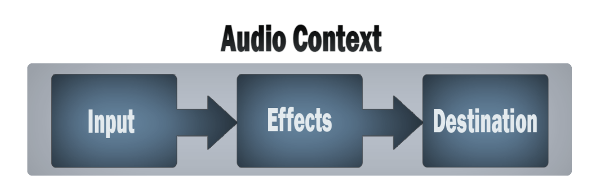

# 你所不知道的HTML5——Audio API
> 承接之前的的博客，今天我们来研究一下 HTML5 Audio API，长文预警

**⚠️注意：**该 API 依然处于草案阶段，但是已经收到了广泛支持（除了，，，IE，，，）

## 概览
首先要明确一个概念 `HTML5 Web Audio API` 并不是 `HTML <audio>` 标签

> Web Audio API 提供了一个功能强大的多功能系统，用于控制Web上的音频，允许开发人员选择音频源，添加音频效果，创建音频可视化，应用空间效果（如平移）等等。 ——摘自 MDN

简单的说，这个API为我们提供了在 Web 端进行音频编辑的能力（类似`Adobe Au`）

在看代码之前我们先来开开脑洞，如果你看到了这篇文章，你很大概率上是一个 Web 前端开发者，你并不熟悉音频处理领域的专业知识，那么我们应该怎么使用这个强大的功能：

- 在 B/S 架构下实现轻量级音频编辑工作站
- 为 Web 上的用户操作增加音效，可以应用在 H5游戏/推广页面上
- 为 Web 语音聊天/视频聊天增加变声功能
- ？？？

OK，如果阅读这篇文章的你对这个 API 产生了兴趣那就请继续阅读吧～

## 工作流程

工作流程的可以按照本文最上方的图片理解：
1. 创建音频上下文
2. 在上下文中，创建源
3. 创建效果节点
4. 选择音频的最终目的地
5. 将信号源连接到效果，将效果连接到目的地

那么下面我们就不严格地按照这个流程做一个简单的 demo

