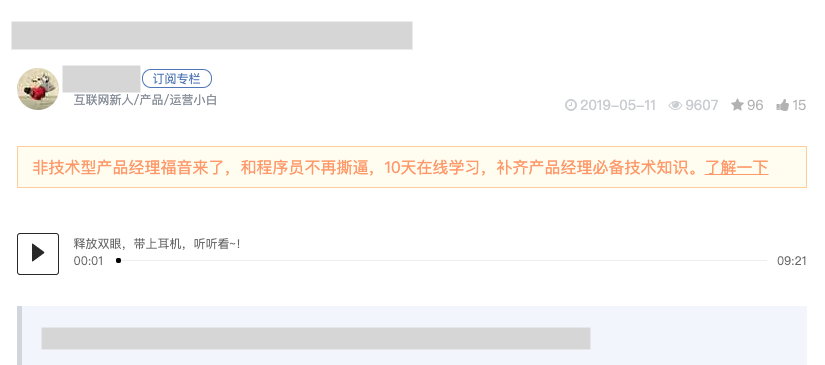
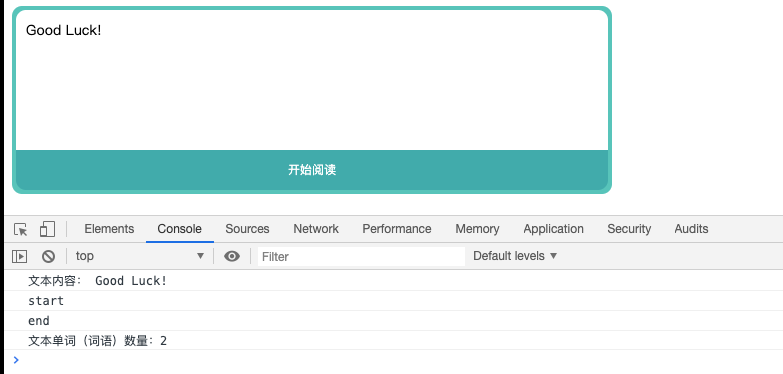
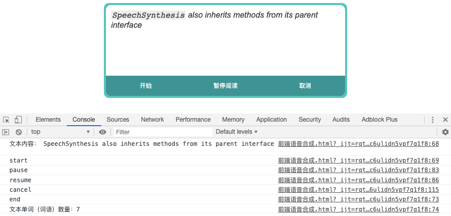

# 你所不知道的HTML5——语音合成
> 前端能力的增强很大程度上依赖于 HTML5 的新 API，从这篇文章开始我也会对平时做不常用的一些 API 做一下学习总结
> 今天的文章就从语音合成开始

为什么想到这个 API 呢？

在写报告查资料的时候在 [“人人都是产品经理”http://www.woshipm.com/](http://www.woshipm.com/) 上发现了一个有趣的功能（打了丑丑的马赛克）

听一下就会发现，播放出来的声音并不是预先录制好的音频资料，而是通过文字识别后合成的语音

那么我们如何在前端实现这样的功能呢？主角登场！

> ⚠️注意，这个 API 尚在草案阶段，并且在写 demo 的时候浏览器提示部分 API 可能将不被支持，所以本文中提到的解决方案不要用于产品中
## 语音合成超简单例子

请先戴上耳机，然后将下面的代码复制到chrome控制台中体验～
```js
let msg = new SpeechSynthesisUtterance("欢迎你阅读我的博客");
window.speechSynthesis.speak(msg);
```
看，前端实现语音合成并不难

## 今天的主角 Speech Synthesis API

通过上面的例子我们可以猜测到上面调用的两个方法的功能
- `SpeechSyntehesisUtteranc` 用来构造一个可以被读出的“东西”
- `window.speechSynthesis.speak` 将构造好的“东西”读出来

当然了，语音合成不仅仅包含这两个API，but我们先从这两点入手
## SpeechSyntehesisUtteranc
参考：[https://developer.mozilla.org/en-US/docs/Web/API/SpeechSynthesisUtterance](https://developer.mozilla.org/en-US/docs/Web/API/SpeechSynthesisUtterance)
`SpeechSyntehesisUtteranc`对象包含了语音服务要读取的内容和一些参数，比如语言，音高和音量

- 首先我们可以通过 `SpeechSyntehesisUtteranc()` 构造函数构造一个对象
- `SpeechSynthesisUtterance.lang` 语言
- `SpeechSynthesisUtterance.pitch` 音调
- `SpeechSynthesisUtterance.rate` 语速
- `SpeechSynthesisUtterance.voice` 语音
- `SpeechSynthesisUtterance.volume` 音量

**注意：** 以上属性都是 **可读写** 的！
可以把下面这段代码copy下来尝试一下，注释中会有说明
```js
let msg = new SpeechSynthesisUtterance();
msg.text = "how are you" // 要合成的文本
msg.lang = "en-US" // 美式英语发音（默认自动选择）
msg.rate = 2  // 二倍速（默认为 1，范围 0.1～10）
msg.pitch = 2 // 高音调（数字越大越尖锐，默认为 1，范围 0～2 ）
msg.volume = 0.5 // 音量 0.5 倍（默认为1，范围 0～1）
window.speechSynthesis.speak(msg);
```

同时这个对象还可以响应一系列事件，可能会用到的：
- `start` 开始阅读
- `end` 阅读结束
- `boundary` 到达单词或句子边界 
- `pause` 暂停
- `resume` 从暂停中恢复

借助这些事件我们可以完成一些简单的功能，比如英文句子的单词数量统计：


```js
let count = 0; // 词语数量
let msg = new SpeechSynthesisUtterance();
let synth = window.speechSynthesis;
msg.addEventListener('start',()=>{
    // 开始阅读
    console.log(`文本内容： ${msg.text}`);
    console.log("start");
});
msg.addEventListener('end',()=>{
    // 阅读结束
    console.log("end");
    console.log(`文本单词（词语）数量：${count}`);
    count = 0;
});
msg.addEventListener('boundary',()=>{
    // 统计单词
    count++;
});
```
经过尝试，由于中文没有用空格将每个词语分开，所以会进行自动的识别，比如 `欢迎读者` 会被识别为 `欢迎` 和 `读者` 两个词语

## SpeechSynthesis

参考：[https://developer.mozilla.org/en-US/docs/Web/API/SpeechSynthesis](https://developer.mozilla.org/en-US/docs/Web/API/SpeechSynthesis)

说完了 `SpeechSyntehesisUtteranc` 我们再来看看 `SpeechSynthesis`

`SpeechSynthesis` 的主要作用是对语音进行一系列的控制，比如开始或者暂停

它有三个只读属性，表明了语音的状态：
- `SpeechSynthesis.paused`（boolean 是否处于暂停）
- `SpeechSynthesis.pending`（boolean 是否处于还有未读语句）
- SpeechSynthesis.speaking` （boolean 是否处于阅读中）

同时还有一系列方法用来操作语音：
- `SpeechSynthesis.speak()` 开始读语音，同时触发 `start` 事件 
- `SpeechSynthesis.pause()` 暂停，同时触发 `pause` 事件
- `SpeechSynthesis.resume()` 继续，同时触发 `resume` 事件 
- `SpeechSynthesis.cancel()` 取消阅读，同时触发 `end` 事件

基于这些操作方法，我们可以进一步增强我们的文字阅读器：


## 回到最初的起点
让我们回到最初的起点，我们可以基于上面的内容猜测一下有些网站中，文章的自动阅读是怎么实现的

如果这个网站前端采用了 MVVM 框架（以 Vue 为例），那么文章内容是也许存储在 data 中，可以用来构造我们需要的语音合成

当然，也有可能文章是通过 ajax 请求得到的，解析请求的数据，构造语音合成对象

如果文章是直接在 html 中写死的，这个时候就需要对 DOM 进行解析，经过测试，即便是下面这样的混乱的结构
```html
<div id="test">
    <p>1</p>
    <p>2</p>
    <ul>
        <li>3</li>
        <li>4</li>
    </ul>
    <table>
        <tr>
            <td>5</td>
            <td>6</td>
        </tr>
        <tr>
            <td>7</td>
            <td>8</td>
        </tr>
    </table>
    
    9
</div>
```
直接通过 innerText 读取其中的文本，然后构造语音合成对象，也能按照期望顺序阅读（图片会被忽略）

当然如果我们想要忽略一些特殊的结构，比如表格，我们可以花一些精力在解析上，把我们不想要的数据或者 DOM 元素筛掉

不管怎样，我们都能找到合适的解决方案～

## 闲话
这个特性，是一个还在草案中的特性，没有被广泛支持

再次强调，这个 API 暂时还不能应用到生产环境中

目前比较通用的做法是在后端构造将文本合成成语音文件的 API（也许是第三方 API），然后在前端作为媒体播放

曾经在我迷茫的时候，我去阅读一些大牛的文章，读到一些前辈对前端开发的思考。其中有一点令我印象深刻：
> 前端是最贴近用户的，一切要从用户的的角度考虑，无障碍使用也是一个很重要的课题。虽然做这样的功能带来的收益远远小于其他业务，但是为了让产品更好的服务用户，多付出一些劳动也是值得的，这也是前端开发的一种精神

本文同步发布于我的[个人博客](https://raaabbit.github.io)，[CSDN](https://blog.csdn.net/github_39457740)，[掘金](https://juejin.im/user/5ad73de5f265da502c218493/posts)

如果有什么问题，意见，建议欢迎评论；如果觉得我写的不错，那就点个赞吧～

demo代码如下
```html
<!doctype html>
<html lang="zh-cn">
<head>
    <meta charset="UTF-8">
    <title>前端语音合成demo</title>
    <style>
        #app{
            width:480px;
            margin: auto;
            background-color: #57c3ba;
            box-sizing: border-box;
            border-radius: 10px;
            padding: 4px;
        }
        #speech-text{
            box-sizing: border-box;
            width: 100%;
            height: 140px;
            outline: none;
            border: none;
            border-radius: 10px 10px 0 0 ;
            padding: 10px;
            font-size: 14px;
            background: #fff;
        }
        #btn-group{
            display: flex;
            border-radius: 0 0 10px 10px;
            overflow: hidden;
            background: #41abab;
            color: #fff;
        }
        #btn-group>button{
            flex: 1;
            height: 40px;
            border: none;
            outline: none;
            color: #fff;
            background: #3e9494;
            transition: background-color .2s;
        }
        #btn-group>button:hover{
            color: #fff;
            background: #41b5b5;
        }
    </style>
</head>
<body>
    <div id="app">
        <div id="speech-text" contenteditable="true">
        </div>
        <div id="btn-group">
            <button id="speak-btn">开始</button>
            <button id="pause-btn">暂停</button>
            <button id="cancel-btn">取消</button>
        </div>
    </div>
<script>
    window.onload = ()=>{

        let count = 0; // 词语数量
        let speechMsg = new SpeechSynthesisUtterance();
        let synth = window.speechSynthesis;
        speechMsg.addEventListener('start',()=>{
            // 开始阅读
            console.log(`文本内容： ${speechMsg.text}`);
            console.log("start");
        });
        speechMsg.addEventListener('end',()=>{
            // 阅读结束
            console.log("end");
            console.log(`文本单词（词语）数量：${count}`);
            count = 0;
            speakBtn.disabled = false;
        });
        speechMsg.addEventListener('boundary',()=>{
            // 统计单词
            count++;
        });
        speechMsg.addEventListener('pause',()=>{
            console.log('pause');
        });
        speechMsg.addEventListener('resume',()=>{
            console.log('resume');
        })
        // 获取文本内容并阅读
        let speakBtn = document.querySelector('#speak-btn');
        let pauseBtn = document.querySelector('#pause-btn');
        let cancelBtn = document.querySelector('#cancel-btn');
        speakBtn.addEventListener('click',(event)=>{
            event.preventDefault();
            speechMsg.text = document.querySelector('#speech-text').textContent;
            synth.speak(speechMsg);
            speakBtn.disabled = true;
        });
        pauseBtn.addEventListener('click',(()=>{
            let speaking = true;
            return (event)=>{
                event.preventDefault();
                if (speaking) {
                    speaking = false;
                    pauseBtn.innerText = "继续";
                    synth.pause();
                }else{
                    speaking = true;
                    pauseBtn.innerText = "暂停";
                    synth.resume();
                }
            }
        })());
        cancelBtn.addEventListener('click',(event)=>{
            event.preventDefault();
            console.log('cancel');
            synth.cancel();
        })
    }
</script>
</body>
</html>
```