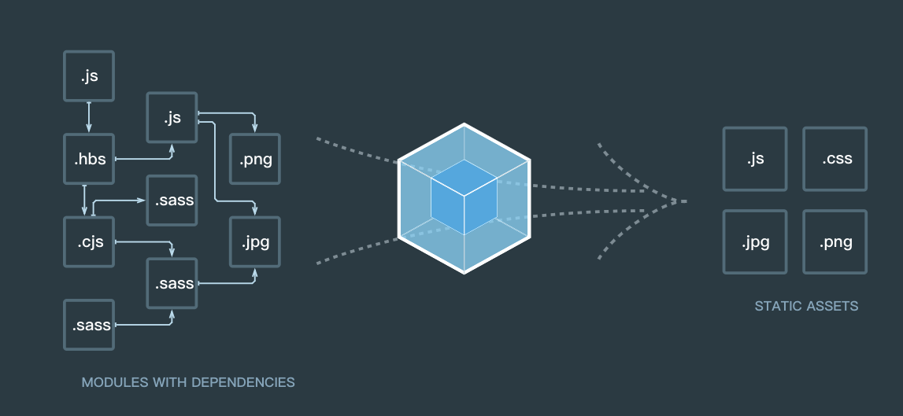

# 初步理解Webpack原理

> 曾经在项目中使用过 webpack 进行打包，之后也使用过 vue-cli 这样的基于 webpack 的脚手架构建项目，那今天就来学习一下 webpack 的原理。webpack5已经也许今年就要发布正式版了，不同版本的配置方法都不尽相同，所以这篇文章不涉及任何具体的配置～

**注：** 本文中所有代码仅有示意的作用，不一定是 Webpack 的真实运行结果～

## 什么是Webpack
首先先对Webpack有一个大致的印象（看上面的图片），Webpack是一个模块打包器，根据模块之间的依赖关系生成新的静态文件资源。

另外，有另外两个工具——`Gulp` 和 `Grunt`，经常被拿来和 `Webpack` 进行对比。我并没有使用过那两个工具，不敢妄加评价，但是要认识到它们和`Webpack`的设计出发点是不同的。我的理解：`Gulp` 和 `Grunt` 是用在开发阶段，优化开发流程的；`Webpack` 是用来进行打包构建生产环境版本的，但是在各种loader的加持下，`Webpack` 已经很大程度上取代了`Gulp` 和 `Grunt`的功能，

## 打包过程中Webpack做了什么

### 分析依赖
在前面也提到了，Webpack 的目的是根据模块之间的依赖关系进行打包，那么首先应该分析模块之间的依赖关系。

首先我们要指定入口文件，这个告诉Webpack从什么地方开始构建依赖关系。

```js
// webpack.config.js
var config = {
  entry: './index.js'
};

// index.js
import {A} form './A.js';
import {B} form './B.js';

// A.js
import {C} form './C.js';
```
先将入口文件读入，然后判断其中的依赖关系，在这个过程中我们要利用到js的解释器，对这个文件的内容进行词法语法分析并生成抽象语法树（AST）。

然后通过入口文件的路径和依赖项相对于入口文件的路径，我们就可以得到所有依赖的路径，并将这个依赖关系存入一个数组。

```js
// 分析 index.js 的结果
{
    id:"0",
    file:"./index.js",
    dependencies:["./A.js","./B.js"]
}
```
接下来将这个数组当作队列，进一步拓展语法分析树（没错，就是树的层级遍历，可以戳 ->[二叉树](https://raaabbit.github.io/%E6%95%B0%E6%8D%AE%E7%BB%93%E6%9E%84%E4%B8%8E%E7%AE%97%E6%B3%95/%E4%BA%8C%E5%8F%89%E6%A0%91/) 了解一下～）

当然了，模块之间的依赖关系也可能不是简单的树形结构，也可能是图，所以遍历就变成了图的 **广度优先遍历** 哦～

如此这般，我们就从入口文件开始，得到了它所依赖的所有模块的位置。
```js
[
    {
        id:"0",
        file:"./index.js",
        dependencies:["./A.js","./B.js"]
    },
    {
        id:"1",
        file:"./A.js",
        dependencies:["./C.js"]
    },
    {
        id:"2",
        file:"./B.js",
        dependencies:[]
    },
    {
        id:"3",
        file:"./C.js",
        dependencies:[]
    }
]
```
同时在这个过程中也要分析这个依赖是同步依赖还是异步依赖，从而提升打包后代码的组织形式。
### 打包

得到所有依赖的位置，也就代表了我们获取了依赖模块的内容。

将代码按照依赖结构图，根据CommonJS规范，组织成为一份完整的代码，最基本的工作就完成了～