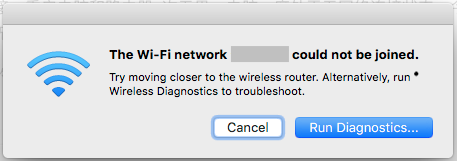
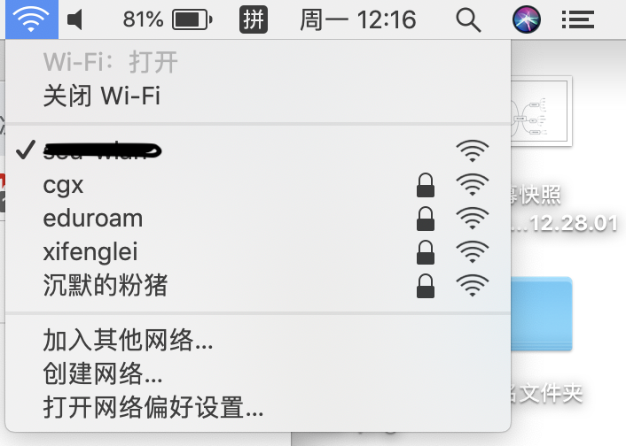

# macbook 无法加入网络？

> 在学校的某一栋教学楼中有这样一个传说，所有的 apple 在这个教学楼中都会失去网络连接，成为一个孤岛～

在排除是路由器的问题后，在macbook上执行下面的操作也许会有效果～
## 解决方法1
关闭Wi-Fi，然后重新连接

## 解决方法2
在网络偏好设置中更改 ip

## 解决方法3
拔下连接在macbook上的外部设备（比如USB拓展坞）

出现这个问题的原因是 macbook 为了保证整体性，各个功能模块一般都是高度集中的，这就导致了 USB 设备会干扰 2.4GHz 的无线网络信号，但是 5GHz 的信号不容易被干扰。同时蓝牙信号也会收到影响，比如蓝牙鼠标、airports等～

## 解决方法4
删除网络的配置文件

1. 首先找到我们的配置文件
- 按组合键: Command + Shift + G, 输入:
/Library/Preferences/SystemConfiguration
- 或者通过 finder 进入目录

2. 找到并删除以下文件
- com.apple.airport.preferences.plist
- com.apple.network.identification.plist
- NetworkInterfaces.plist
- preferences.plist
清空废纸篓，然后重启~~

## 解决方法5
重置SMC，详情请参考官方文档 -> [如何重置 Mac 上的系统管理控制器 (SMC)](https://support.apple.com/zh-cn/HT201295)

虽然按照文档所说，这个操作并不能解决网络问题，but 这个方法真正解决了我的问题，如果不想看文档，就直接按照下面的步骤操作：

### 针对于没有安装 T2 芯片的机型（2018年之前）：
- 选取苹果菜单 >“关机”。
- 在 Mac 关机后，按下内建键盘左侧的 Shift-Control-Option，然后同时按下电源按钮。按住这些按键和电源按钮 10 秒钟。如果您的 MacBook Pro 配有触控 ID，则触控 ID 按钮也是电源按钮。
- 松开所有按键。
- 再次按下电源按钮以开启 Mac。

### 针对于安装 T2 芯片的机型（2018年及之后的版本）：
先尝试以下操作：

- 选取苹果菜单 >“关机”。
- 在 Mac 关机后，按住电源按钮 10 秒钟。
- 松开电源按钮，然后等待几秒钟。
- 再次按下电源按钮以开启 Mac。

如果上述操作无法解决问题，请按照以下步骤操作：

- 选取苹果菜单 >“关机”。
- 在 Mac 关机后，按住右 Shift 键、左 Option 键和左 Control 键 7 秒钟。然后，在按住电源按钮的同时继续按住这些按键 7 秒钟。
- 松开所有三个按键和电源按钮，然后等待几秒钟。
- 再次按下电源按钮以开启 Mac。
 