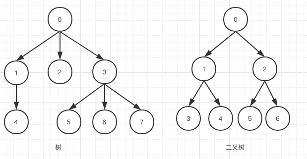
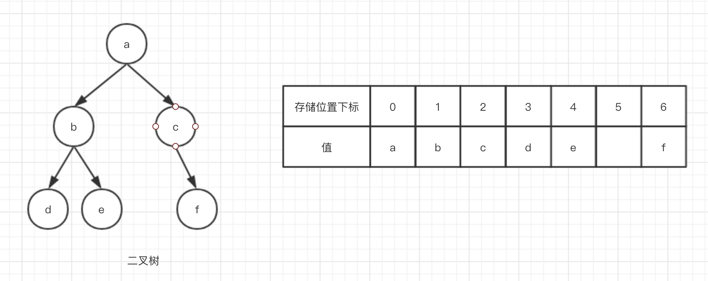

# 二叉树
二叉树的定义，二叉树的链式存储结构，二叉树的顺序存储结构，二叉树的遍历方法

**注意：** 本文不包含平衡树，排序树等特殊的二叉树，敬请期待～

## 什么是二叉树
首先我们要明确数据结构中树的概念，树是N个结点的有限集合，这些结点满足下列条件：

- 有且仅有一个特定的结点作为根结点
- 当N>1时，其余的节点构成m个集合，每个集合也构成一棵树
- 树的根结点没有前驱结点
- 树的所有结点有大于等于零个后继结点
这就是树的递归定义

而二叉树就是每一个结点点至多有两个后继结点的树

## 二叉树的链式存储
二叉树的链式存储依赖于指针，当然指针是C/C++中的概念，在其他语言中，只要可以按照引用传递参数就可进行链式存储。比如执行下面的JS代码：
```js
let pnode = { val : 1 };
let lnode = { val : 2 };

pnode.lchild = lnode;
console.log(pnode);     // { val: 1, lchild: { val: 2 } }
pnode.lchild.val = 4;
console.log(lnode);     // { val: 4 }
```
因为对象是在堆空间中的，存储在栈空间中的只是对象的地址

那么，如果是基于类的面向对象编程方法，我们可定义一个树的结点类，然后借此构建一个二叉树。
```js
// 定义结点类
class TreeNode {
    constructor(val,lnode,rnode){
        this.val = val;
        this.lchild = lnode;
        this.rchild = rnode;
    }
}
// 构造一个最简单的二叉树
let lnode = new TreeNode('left',void 0,void 0)
let rnode = new TreeNode('right',void 0,void 0)
let root = new TreeNode('father',lnode,rnode);
console.log(root);
```

## 二叉树的顺序存储

> **一点个人理解：** 二叉树的一个重要特点是在顺序存储结构中，根据father结点的索引n就可以得到left-child结点的索引2n+1和right-child结点的索引2n+2

顺序存储要求利用连续的存储空间来表达二叉树，如图～



这样做的一个很明显的好处是在访问已知位置的子节点的时候非常快，并且不需要再存储子结点的位置。

同样的，除了满二叉树很大一部分空间都被浪费了（动态语言没有这个顾虑～）。

## 二叉树的遍历

常见的二叉树的遍历分为四种

- 前序遍历：根左右
- 中序遍历：左根右
- 后序遍历：左右根
- 层级遍历：二叉树从根向下，从左向右进行遍历

**⚠️注：** 我们以 `console.log(node.val)` 表示访问一个结点，结点请参考上面的代码例子。以递归的方式更容易，如果对空间复杂度要求高的话可以用栈改写为循环。

### 递归的前中后序遍历 
```js
// 前序遍历
function preorder(node){
    console.log(node.val);
    preorder(node.lchild);
    preorder(node.rchild);
}
// 中序遍历
function inorder(node){
    inorder(node.lchild);
    console.log(node.val);
    inorder(node.lchild);
}
// 后序遍历
function postorder(node){
    postorder(node.lchild);
    postorder(node.rchild);
    console.log(node.val);
}
```

### 二叉树+栈 非递归前中遍历

这里仅用中序遍历举个例子，前序同理～
```js
// 非递归的中序遍历方式，时间空间复杂度更低！！！
function inorderPlus(node){
    let stack = []; // 便利栈，用来存储遍历过的结点
    let temp = node;
    while(true){
        while(temp){
            // 有限遍历左子结点
            stack.push(temp);
            temp = temp.lchild;
        }
        if(stack.length > 0){
            // 弹出栈，遍历右字结点点
            temp = stack.pop();
            console.log(tmep.val);
            temp = temp.rchild;
        }else{
            break;
        }
    }
}
```

### 二叉树+队列 层级遍历

这个是针对链式存储而言的，顺序存储直接顺序访问存储空间就好了哇～
> 小知识，`js`数组中的`push`和`pop`是对数组尾部进行操作，`shift`和`unshift`是对数组头部进行操作，可以用这个来模拟数组或者队列。当然了，为了严谨我们也可以进行二次封装～
```js
// 层级遍历
function levelOrder(node){
    let queue = [];
    let temp = node;
    while(temp){
        console.log(temp.val);
        if(temp.lchild){
            queue.push(temp.lchild);
        }
        if(temp.rchild){
            queue.push(temp.rchild);
        }
        temp = queue.shift();
    }
}
```


