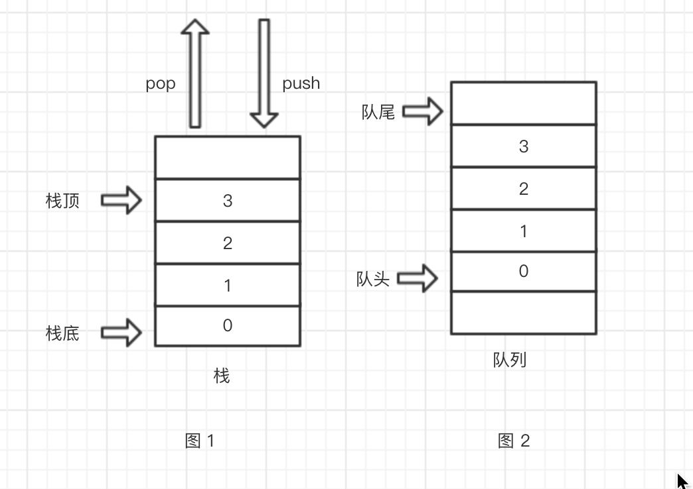
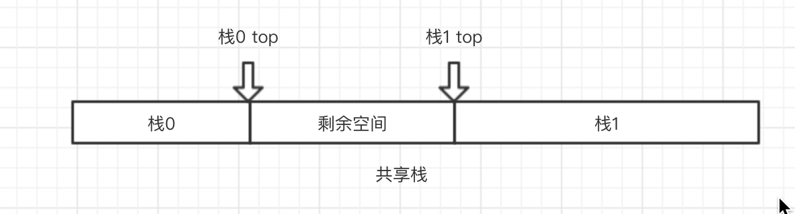
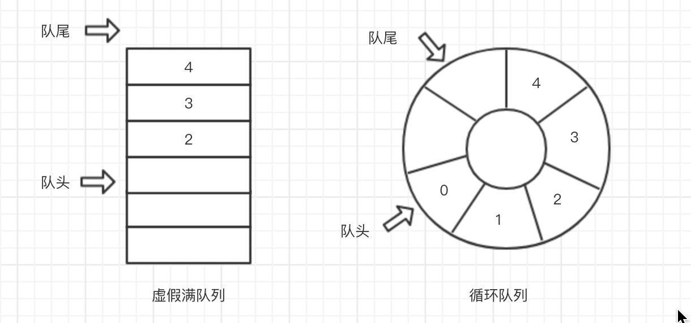

# 栈与队列

## 栈
栈是一种很常用的数据结构，是一个 **只能在一端进行插入和删除操作** 的线性表。
### 栈的一些基本概念
- 栈顶：线性表允许进行操作的一端
- 栈底：线性表不允许操作的一段
- 后进先出：栈中元素的入栈和出栈操作是符合后进先出规则的，如下图1
### 栈的基本操作
一般的栈都会用到如下操作，这里列出的操作也会在后面直接以简称的形式出现～
- 初始化空栈: initStack()
- 判断栈是否为空: isEmpty() 
- 入栈: push()
- 出栈: pop()
- 读取栈顶元素: getTop()
### 栈的顺序存储结构
一般情况下，栈中元素占据连续的物理空间，在不同语言的实现中，栈顶指针可能始终指向栈顶的元素，也可能指向栈顶元素的下一个元素，此时判断空栈/满栈的条件要进行灵活的调节。
```javascript
// 栈顶指针始终指向栈顶的元素
function isEmpty(S){
    if(S.top < 0){
        return true;
    }else[
        return false
    ]
}
function ifFull(S){
    if(S.top == MAX_SIZE){
        return true;
    }else{
        return false;
    }
}
```    
在空栈情况下，栈顶指针和栈底指针指向同一块地址
### 特殊的共享栈
由于栈的特性，可以将两个栈的栈顶对接在一起（就好像两个口对在一起的水杯。这样做的目的是充分利用一个连续的固定大小的存储空间，当两个栈顶指针相邻的时候说明这个存储空间满了～

**注意：** 0号栈push的时候，要先将top++；而1号栈push的时候要将top--

## 队列
队列也是一种受到限制的线性表，只允许在一端进入，另一端进行删除
（见图2
### 队列的一些基本概念
- 队头：允许删除的一端
- 队尾：允许插入的一端（？？
- 空队列：不含任何元素的空表
### 队列的基本操作
- 初始化空队列：initQueue
- 判断队列为空：isEmpty
- 入队：inQueue
- 出队：outQueue
###队列的存储结构
一般的队列采取顺序表存储，队头指针指向队头元素的下一个位置，队尾指针指向队尾元素（也可以定义为队头指针指向队头元素，队尾指针指向队尾元素的后一个位置）。

但是传统的队列有一个问题：当队尾元素占据了顺序表的最后一个位置，不管这块存储空间还有没有空间，都无法再入队，造成一种**虚假满队列现象**  ~~（我起的名字hiahia）~~ 。     
要解决上述问题，有两种办法，第一种是探测是否真的是满队列（队头指针指向0，队尾指针指向MAX_SIZE），如果真的是满队列，报出溢出异常，如果是假满队列就申请新的空间，做一次拷贝。

**更好的解决方法** 是用循环队列解决问题，将这个队列假想成一个环。当队尾指向顺序表的最后时，如果想要入队，就把新节点放进顺序表的第一个位置（当然，前提是这块空间没有满～）


## 栈和队列的应用

我认为，栈和队列的重要性不在于存储数据，栈和队列在调度上有神奇的作用。如：
- 使用栈进行匹配分析
- 使用栈解决递归问题
- 使用队列进行缓冲
- 使用队列进行多任务调度

可以参考一节哦～ ->[二叉树](https://raaabbit.github.io/%E6%95%B0%E6%8D%AE%E7%BB%93%E6%9E%84%E4%B8%8E%E7%AE%97%E6%B3%95/%E4%BA%8C%E5%8F%89%E6%A0%91/#%E4%BB%80%E4%B9%88%E6%98%AF%E4%BA%8C%E5%8F%89%E6%A0%91)