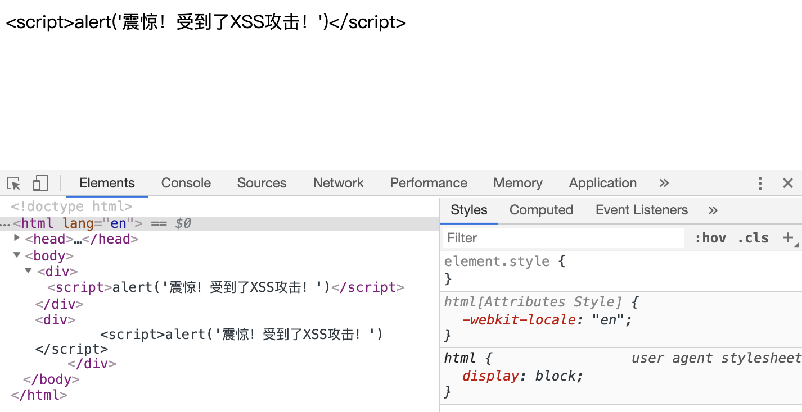

# XSS攻击

> 在准备春招实习的时候突然意识到自己对 web安全领域的知识几乎是空白，下面对在前端可能会遇到的web安全问题进行一个简单的总结，今天就从XSS开始～

## 什么是XSS攻击
XSS攻击的全称是 Cross-site script，也就是跨站脚本攻击，为了和 CSS 区分，这里把攻击的第一个字母改成了 X，于是叫做 XSS。

XSS攻击是一种经常出现在 web应用的攻击，攻击者通过在目标网站上注入恶意脚本，使之在用户的浏览器上运行。利用这些恶意脚本，攻击者可获取用户的敏感信息如 Cookie、SessionID 等，进而危害数据安全。

在 web 前端方面，可以理解为在前端进行代码植入，当用户浏览这个网站的时候，这段代码就会自动执行，举个例子：
如果在一个存在XSS漏洞的网站评论区或者表单中填写代码：
```html
<script>
    window.location.href = "https://raaabbit.github.io"
</script>
```
那么，当评论成功提交，其他用户在浏览页面的时候成功加载了这段代码，他们就会来到我的博客（尴尬而又不失礼貌的微笑

除了这样干扰其他用户使用之外，还可以进行窃取信息这样的操作，比如获取用户在当前页面下的cookie，然后发送到自己的服务器上，攻击者就得到了用户的“钥匙”，进而可以冒充用户进行操作，窃取财产或者传播不良信息等等

## XSS攻击的种类
在这里将XSS攻击分为三种：
- 存储型XSS
- 反射性XSS
- DOM型XSS
### 存储型XSS
这种XSS攻击是持久型的，因为恶意代码一般都被存储在了数据库中，比如上面例子中的评论

攻击者将恶意代码提交到目标网站的数据库中

用户打开目标网站时，网站服务端将恶意代码从数据库取出，拼接在 HTML 中返回给浏览器

用户浏览器接收到响应后解析执行，混在其中的恶意代码也被执行

恶意代码窃取用户数据并发送到攻击者的网站，或者冒充用户的行为，调用目标网站接口执行攻击者指定的操作

### 反射型XSS
这种XSS攻击的代码并不存储在数据库中，而是存储在构造好的URL中，比如下面这样：
```html
http://xxx?keyword="><script>alert('XSS');</script>
```
- 攻击者构造出特殊的 URL，其中包含恶意代码
- 用户打开带有恶意代码的 URL 时，网站服务端将恶意代码从 URL 中取出，拼接在 HTML 中返回给浏览器
- 用户浏览器接收到响应后解析执行，混在其中的恶意代码也被执行
- 恶意代码窃取用户数据并发送到攻击者的网站，或者冒充用户的行为，调用目标网站接口执行攻击者指定的操作

和上面的存储型XSS不同，这样的存储方式并不是持久性的，同时作用范围也远远小于存储型XSS，攻击者要通过各种手段诱导用户点击恶意链接
### DOM型XSS
这种攻击方式也需要攻击者构造出特殊的 URL，其中包含恶意代码，并且诱导用户点击

用户浏览器接收到响应后解析执行，前端 JavaScript 取出 URL 中的恶意代码并执行。

恶意代码窃取用户数据并发送到攻击者的网站，或者冒充用户的行为，调用目标网站接口执行攻击者指定的操作。

**注意：** 和前面两种攻击方式的区别在于取出和执行恶意代码由浏览器端完成，属于前端 JavaScript 自身的安全漏洞，而其他两种 XSS 都属于服务端的安全漏洞。

## 防护XSS
### 基本解决方法：转义
一般的脚本都会被包裹在 script 标签中，我们只要对它进行转义：
```html
<div>
<!-- 转义前 -->
    <script>alert('震惊！受到了XSS攻击！')</script>
</div>
<div>
<!-- 转义后 -->
    &lt;script&gt;alert(&apos;震惊！受到了XSS攻击！&apos;)&lt;/script&gt;
</div>
```
转义后呈现在页面上的时候就是这个样子：


我们可以看到，转义后的代码只是一段文本，转义前的代码是一个脚本

也就是说，在一个web应用的防护中，当有用户的输入场景的时候，要进行转义，避免这样造成的XSS攻击（或者用户无意造成的污染）；在解析请求到的数据/资源的时候，也应当进行初步的过滤，这也就是我们经常听到的不建议使用`innerHTML`的原因

### 进阶解决方案 
But 不要以为进行了转义就万事大吉了，因为XSS的注入方式很多：

- 在 HTML 中内嵌的文本中，恶意内容以 script 标签形成注入。
- 在内联的 JavaScript 中，拼接的数据突破了原本的限制（字符串，变量，方法名等）。
- 在标签属性中，恶意内容包含引号，从而突破属性值的限制，注入其他属性或者标签。
- 在标签的 href、src 等属性中，包含 javascript: 等可执行代码。
- 在 onload、onerror、onclick 等事件中，注入不受控制代码。

如此这般我们需要多方面进行防御

1.使用输入过滤：对用户提交的数据进行有效性验证，仅接受指定长度范围内并符合我们期望格式的的内容提交，阻止或者忽略除此外的其他任何数据。比如：电话号码必须是数字和中划线组成，而且要设定长度上限。过滤一些些常见的敏感字符，例如：< > ‘ “ & # \ javascript expression  "onclick="  "onfocus"；过滤或移除特殊的Html标签， 例如: <script>, <iframe> ,  &lt; for <, &gt; for >, &quot for；过滤JavaScript 事件的标签，例如 "onclick=", "onfocus" 等等。输出编码，当需要将一个字符串输出到Web网页时，同时又不确定这个字符串中是否包括XSS特殊字符（如< > &‘”等），为了确保输出内容的完整性和正确性，可以使用编码（HTMLEncode）进行处理。
2. DOM型的XSS攻击防御：把变量输出到页面时要做好相关的编码转义工作，如要输出到 <script>中，可以进行JS编码；要输出到HTML内容或属性，则进行HTML编码处理。根据不同的语境采用不同的编码处理方式。
3.HttpOnly Cookie：将重要的cookie标记为http only,   这样的话当浏览器向Web服务器发起请求的时就会带上cookie字段，但是在脚本中却不能访问这个cookie，这样就避免了XSS攻击利用JavaScript的document.cookie获取cookie：

